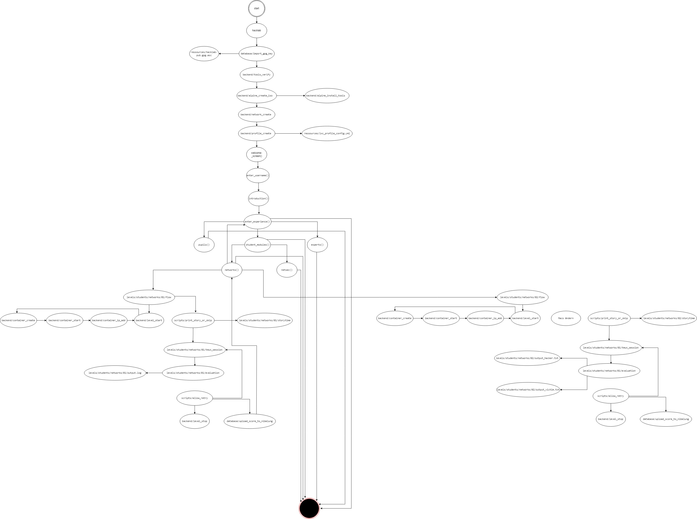

<!--
SPDX-FileCopyrightText: 2022 Bassam-Khaled Thiab <inf3891@hs-worms.de>
SPDX-FileCopyrightText: 2022 Dominic Meyer <inf3644@hs-worms.de>
SPDX-FileCopyrightText: 2022 Felix Rheinheimer <felix.rheinheimer@hs-worms.de>
SPDX-FileCopyrightText: 2022 Jean-Arole Fotsing <inf3608@hs-worms.de>
SPDX-FileCopyrightText: 2022 Katrin Vollhardt <inf3493@hs-worms.de>
SPDX-FileCopyrightText: 2022 Steve Landry Tchamabe <infXXXX@hs-worms.de>
SPDX-FileCopyrightText: 2022 Syed Saad-Ullah <inf3664@hs-worms.de>
SPDX-FileCopyrightText: 2022 Thierry-Junior Djeutchou-Njieyong <inf3494@hs-worms.de>

SPDX-License-Identifier: GPL-3.0-or-later
-->

# HackLab

Welcome to the repository of the project of team HackLab! 

## Documentation

| Scripts | C programs | Levels |
|---|---|---|
| [Overview](scripts.md) | | |
| [level_start](scripts.md) | | |
| [level_stop](scripts.md) | | |

## Storyline

The story line in itself is still a work in progress, but the current story idea is the following: 

<code>Your weird professor has been hinting at a plan to overtake the worlds telecommunication by seizing control of all home devices (IOT) and using them to doxx important services. You and your friends always were suspicious of him and are now trying to find a way to stop his ways. </code>

Whether we use all of this story is not determined yet, but it is our rough draft.

## Was ist das Ziel der Software?

Setze Netzwerk Konzepte mit unserem HackLab in die Praxis um und tauche tiefer in die Cyber Security-Welt ein! Im HackLab kannst du nicht nur innerhalb einer realistischen Umgebung Angriffe auf Netzwerke ausüben, sondern auch lernen, wie man sich gut gegen solche Angriffe verteidigt.

## Welche Komponenten werden benötigt?

-	Linux Umgebung mit apt & snap Paketmanager
-	RZ-Account der HS-Worms (nur für das Hochladen der Punkte notwendig)
-	Einmalige Internetverbindung für das Erstellen des Container Images
-	tmux
-	LXD/LXC
-	gpg
-	(g)awk
-	(mail)
-	tshark/tcpdump
-	hping3
-	ettercap

## Troubleshooting

Falls ein Fehlverhalten im Backend auftritt, gibt es die Möglichkeit sich die log-Files im backend/logs/ Ordner anzuschauen.
Mit dem Skript <code>backend/level_stop $1 $2  $3</code> können die Container eines Levels gestoppt werden.
Daraufhin können diese mit <code>backend/level_start $1 $2  $3</code> wieder gestartet werden
- <code>$1 = pupil/expert or module, if student</code>
- <code>$2 = level</code>
- <code>$3 = number of containers</code>

Falls Probleme bei <code>backend/level_start</code> auftreten, können die Skripte, auf die dort verwiesen wird, einzeln mit zeitlichem Abstand aufgerufen werden. Wenn diese durchgelaufen sind, kann der erwartete Zustand überprüft werden. 

<code>hacklab v</code> zeigt den detaillierten Ablauf des Programms im Terminal.
Die Option <code>set -x</code> kann auch nur in einzelnen Skripten gesetzt werden, dann wird der detaillierte Ablauf dieser Skripte angezeigt. 

## Was muss beachtet werden, wenn ein neues Level erstellt werden soll

1.	<code>levels/knowledge/module/level/flow</code> datei anlegen (modul und level angeben)
2.	<code>levels/knowledge/module/level/story.txt</code> mit Text füllen
3.	<code>levels/knowledge/module/level/storytime</code> erstellen und entsprechend dem Text aus <code>levels/knowledge/module/level/story.txt</code> anpassen
4.	Falls benötigt, <code>levels/knowledge/module/level/tmux_session</code> für das neue Level erstellen
5.	Falls benötigt, <code>levels/knowledge/module/level/topology.txt</code> für das neue Level erstellen 
6.	Evaluation für das neue Level erstellen, um überprüfen zu können, ob das Level erfolgreich durchgeführt wurde –> mit Punktevergabe
7.	In der <code>levels/knowledge/module/level/flow</code> Datei die entsprechenden Aufrufe in die korrekte Reihenfolge bringen
8.	Aufruf der <code>levels/knowledge/module/level/flow</code> Datei in <code>hacklab</code> an der entsprechenden Stelle
9.	Titel des neuen Levels in <code>ressources/menu_options_with_description.txt</code> hinzufügen, um es im Menu anzuzeigen

## Bekannte Bugs

## Diagramm der Programm-Architektur

 
