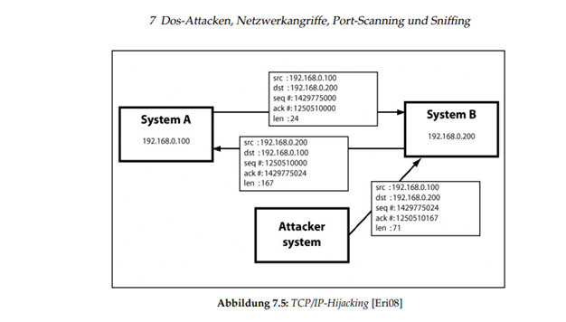

<!--
SPDX-FileCopyrightText: 2022 Bassam-Khaled Thiab <inf3891@hs-worms.de>
SPDX-FileCopyrightText: 2022 Dominic Meyer <inf3644@hs-worms.de>
SPDX-FileCopyrightText: 2022 Felix Rheinheimer <felix.rheinheimer@hs-worms.de>
SPDX-FileCopyrightText: 2022 Jean-Arole Fotsing <inf3608@hs-worms.de>
SPDX-FileCopyrightText: 2022 Katrin Vollhardt <inf3493@hs-worms.de>
SPDX-FileCopyrightText: 2022 Steve Landry Tchamabe <infXXXX@hs-worms.de>
SPDX-FileCopyrightText: 2022 Syed Saad-Ullah <inf3664@hs-worms.de>
SPDX-FileCopyrightText: 2022 Thierry-Junior Djeutchou-Njieyong <inf3494@hs-worms.de>

SPDX-License-Identifier: GPL-3.0-or-later
-->

# Summary of all used resources

## I.	Attack and defence Scenarios search

1.	[Tobias, 2014] Tobias, H. (15.01.2014) Bachelorarbeit: Grundlegende Techniken der praktischen IT-Sicherheit aus Angreifersicht. https://libdoc.fh-zwickau.de/opus4/frontdoor/deliver/index/docId/8942/file/Bachelorarbeit_Tobias_Heinlein_15012014.pdf 
In this file, just point 7 was useful to us, when we wanted to determine how some of the attacks we should play would be implemented

For example: 

2.	[Hughes, 2014] Hughes C. Angriffsszenarien: Die 8 Häufigsten Angriffsszenarien. https://wi.uni-potsdam.de/homepage/lehrewi.nsf/0/CC9D442FC6DE536AC12581D200495D70/$FILE/Angriff%20und%20Verteidigung.pdf (Last Visit: 21.02.2022).
Another file that helped us to refresh our knowledge about the attack scenarios and how they are then implemented. 

## II.	LXD-Container

Our containers, which are started at every level, are networked together with a bridge. This page helped us understand how to configure the bridge

1.	[Zefanja, 2019] Zefanja (07.02. 2019) ZEFANJAS: Netzwerkbrücke für lxd Container. https://zefanjas.de/netzwerkbruecke-fuer-lxd-container-einrichten/ (Last Visit: 21.02.2022).

2.	https://linuxcontainers.org/lxc/getting-started/#creating-unprivileged-containers-as-a-user (Last Visit: 22.02.2022)

3.  https://linuxcontainers.org/lxd/docs/master/image-handling/ (Last Visit 03.03.2022)

4.  https://techgoat.net/index.php?id=60 (Last visit: 03.03.2022)

## III.	Shell- and Ansible scripting 

We had to automate the creation of our containers so that they can only be created with one command. For this we then needed scripts. These pages were also helpful to us for this.

1.	[Bart, 2017] Bart (26.04.2017) How to use LXD (Linux containers) in a shell script. https://www.cyberciti.biz/faq/how-to-create-lxd-vm-when-the-cloud-instance-launches/ (Last Visit: 21.02.2022).
2.  [Red Hat, 2017] Red Had (01.12.2020) Ansible: lxd_container - Manage LXD Containers. https://docs.ansible.com/ansible/2.4/lxd_container_module.html (Last Visit: 21.02.2022).
3.  [Codeberg,2021] Codeberg. Ansible: Ansible role to install LXD server and setup LXD containers https://codeberg.org/ansible/lxd-server (Last Visit: 21.02.2022).
4.  [Kevin, 2021] Kevin C. (21.12.2021) Ansible: Lxd Container Manage. https://docs.ansible.com/ansible/latest/collections/community/general/lxc_container_module.html (Last Visit: 21.02.2022). 

5.  https://docs.ansible.com/ansible/latest/user_guide/playbooks_variables.html (Last Visit: 22.02.2022) 

6.  https://docs.ansible.com/ansible/latest/user_guide/playbooks_variables.html (Last Visit: 22.02.2022)

7.  https://devdojo.com/bobbyiliev/how-to-create-an-interactive-menu-in-bash ()Last visit: 03.03.2022)

## IV.	Alpine ISO: 

The goal was to create containers that are safe. That's why we thought we would then take a snapshot and create an image from it, (in our case Alpine, because it requires little storage space). This image should then be a template for the other containers, as we also have many containers. So on the following page you will find a detailed order of how this becomes possible.

1.	https://techgoat.net/index.php?id=60 (Last Visit:22.02.2022)
on this Page you will find an introduction to how to use Alpine Linux.

2.	https://wiki.alpinelinux.org/wiki/Package_management (Last Visit: 22.02.2022).
In order to be able to play through our attacks and Defence, we need some tools that help us with monitoring, management, control and security. Lynis is a tool that is responsible for performing security checks in the Linux environment. More information about it and how it is operated can be found on the following page

3.	https://cisofy.com/documentation/lynis/get-started/#installation-git (Last Visit: 22.02.2022).

This link was usuful to us when we wanted to install the man page in our containers:

4.  https://ostechnix.com/how-to-install-man-pages-in-alpine-linux/( Last Visit: 03.03.2022).

## V. TMUX

We should find a way to automatically launch TMUX and directly have a predefined screen number us, as soon as the Containers were to be created. These following Links have been of great help

1.  https://kgiann78.github.io/2020/12/29/organize-tmux-session-in-multiple-panels/ (Last visit: 03.03.2022)

2.  https://manpages.ubuntu.com/manpages/trusty/en/man1/tmux.1.html (Last visit: 03.03.2022)

